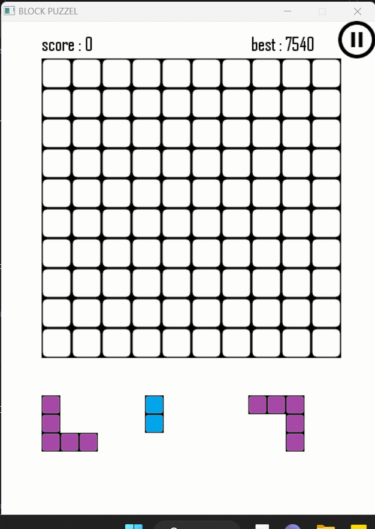
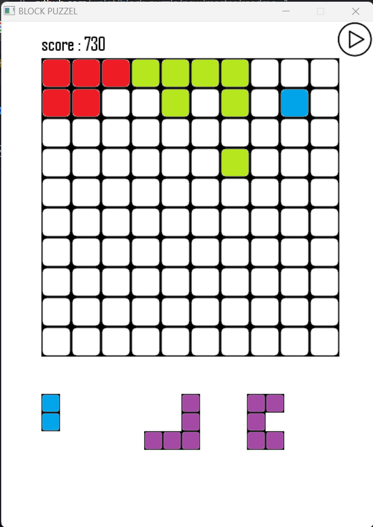
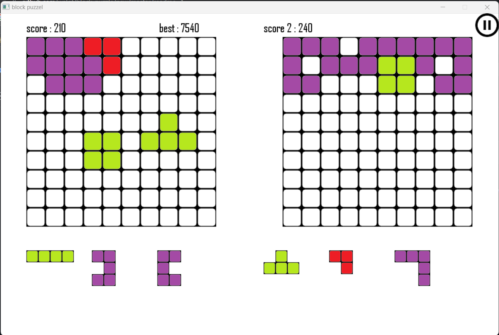

# block-puzzle
Block puzzle is a type of puzzle game where the player is presented with a set of blocks of various shapes and sizes, and must fit them together to fill a defined area.
It has several modes where you can play either the original game, or against a friend, or even letting the computer playby itself thanks to an intelligent algorithm.
 
## Screenshots from the game : 
## Classic mode : 

## Machine mode : 

## Human vs Machine mode : 

